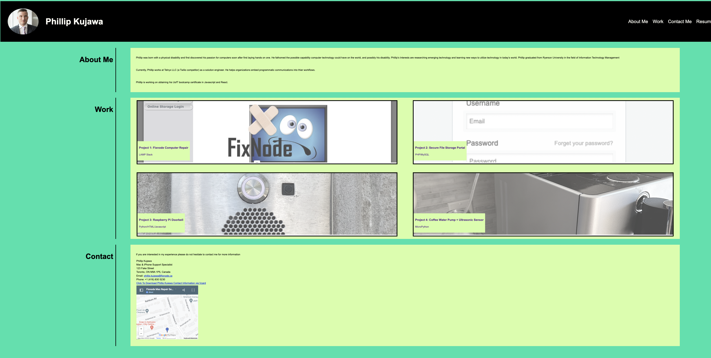

# My Professional Portfolio - Advanced CSS
## Description

This is the module 2 challenge. In this challenge I created a website that covers a portfolio of work that can showcase my skills and talents to employers.

## Live URL

Live URL Link: https://phillipkujawa.github.io/professional-portfolio-module2/

## Changelog

* Added a descriptive website title
* Added descriptive alt attributes to HTML img tags
* Created a CSS sylesheet
    * Added main tag for the main page content
    * Added footer and header tags
    * Added nav tags for navigation bar
    * Added profile picture
    * Added a root variable section in CSS
* Created an HTML file and created a webpage that contains my name, a recent photo or avatar, and links to sections about me, my work, and how to contact me
* Created a hover on the projects section to scale to 1.5% times bigger than other pictures
* Created a UI that scrolls to the corresponding sections from the nav-bar
* Created a responsive layout that adapts to my viewport

## Contributor

* @phillipkujawa

## License

MIT License
